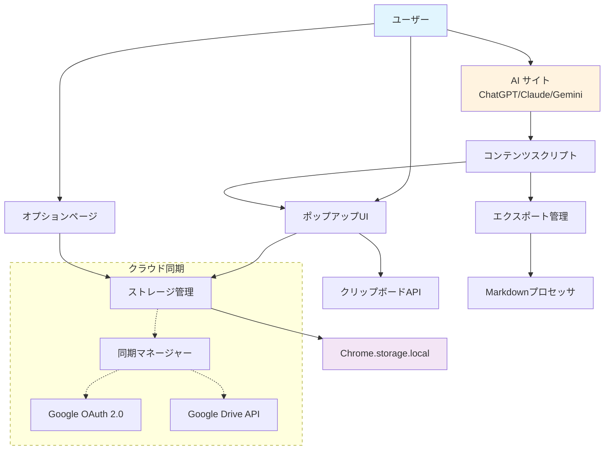
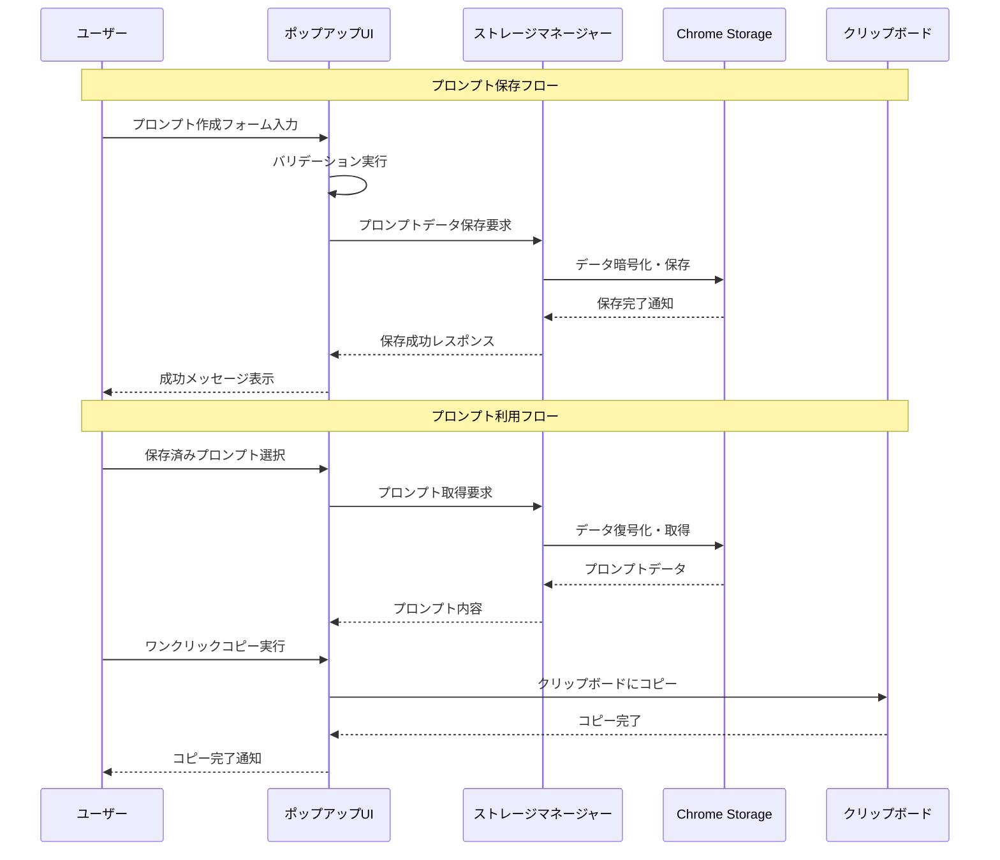
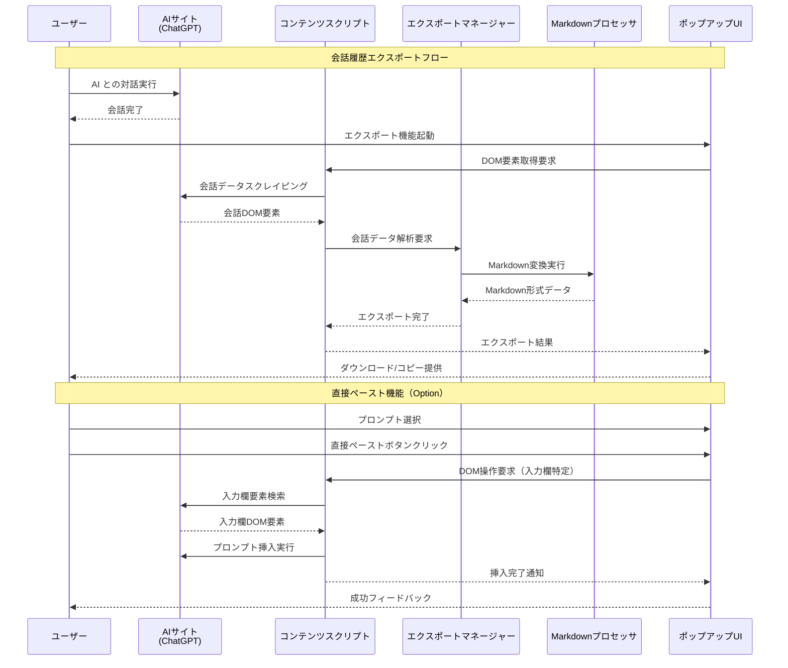
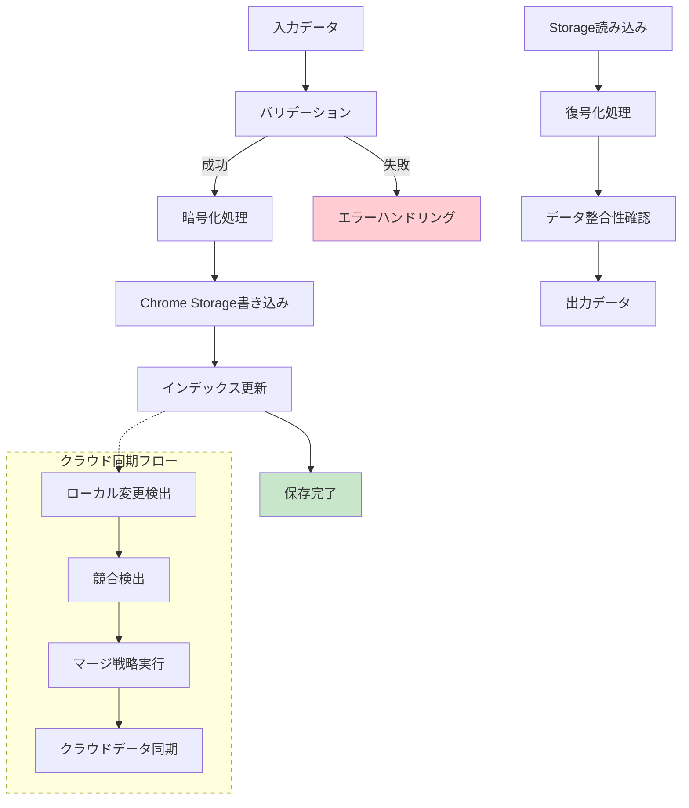
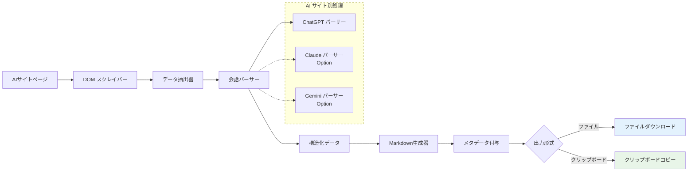
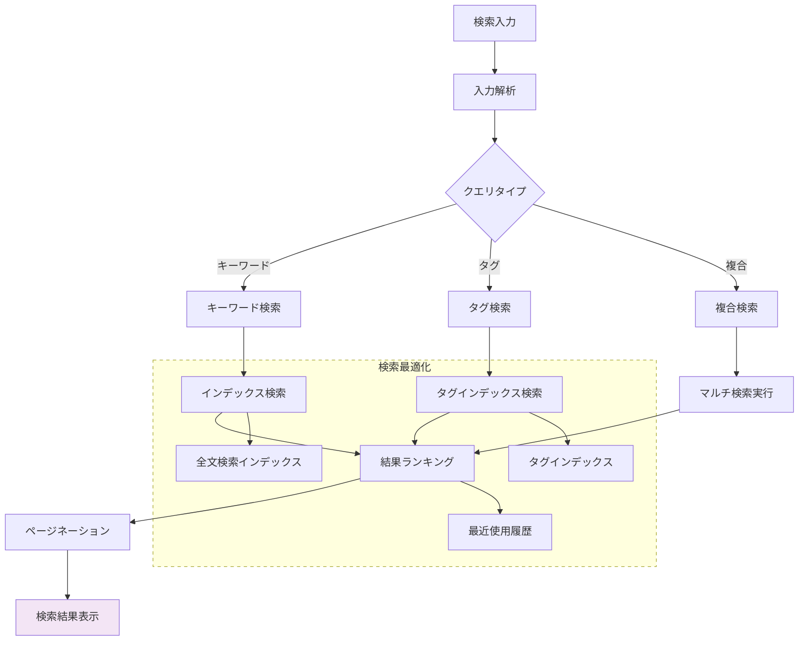
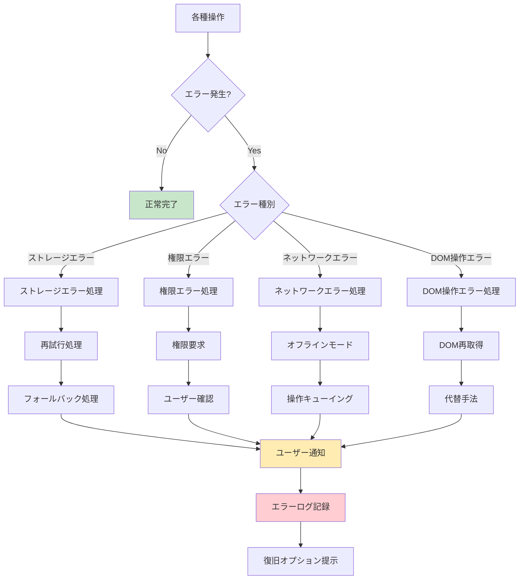
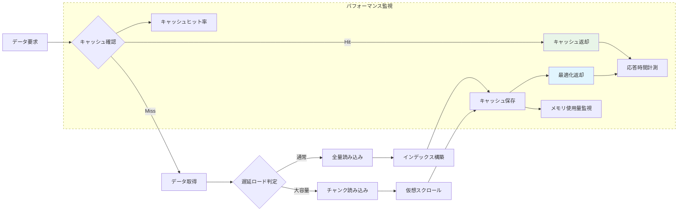
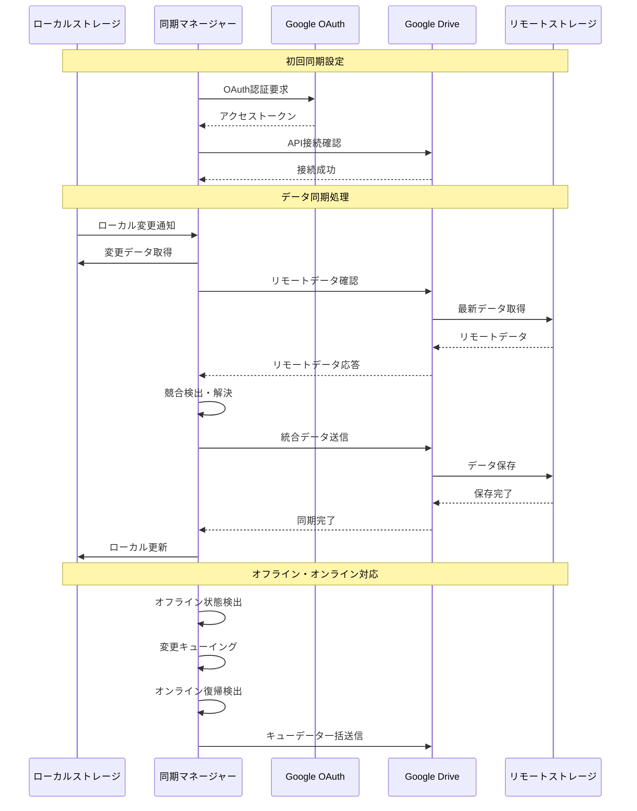

# Pocket-Prompt データフロー図

## システム全体のデータフロー

### 高レベルアーキテクチャフロー

🟢 **青信号**: 全体フローは要件定義のシステム境界とコンポーネントから直接構築

## ユーザーインタラクションフロー

### 1. プロンプト管理フロー

🟢 **青信号**: プロンプト管理フローは要件REQ-001, REQ-002から直接設計

### 2. AIサイト連携フロー

🟢 **青信号**: AIサイト連携は要件REQ-003, REQ-303から直接設計

## データ処理フロー

### 1. ストレージ管理フロー

🟡 **黄信号**: 暗号化・復号化処理は要件NFR-102から、同期フローは要件REQ-305から推測

### 2. エクスポート処理フロー

🟢 **青信号**: ChatGPTエクスポートは要件REQ-003から、Option機能は要件REQ-304から直接設計

## 検索・フィルタリング処理フロー（Option機能）

🟢 **青信号**: 検索機能は要件REQ-302から直接設計

## エラーハンドリングフロー

🟡 **黄信号**: エラーハンドリング戦略は要件EDGE-001〜004と一般的な Chrome拡張エラー対応から推測

## パフォーマンス最適化フロー

🟡 **黄信号**: パフォーマンス最適化フローは要件NFR-001〜003の基準から推測

## データ同期フロー（Cloud Sync - Option機能）

🟢 **青信号**: クラウド同期フローは要件REQ-305のGoogle連携から直接設計

このデータフロー設計により、Pocket-Prompt Chrome拡張の全体的なデータの流れと各コンポーネント間の相互作用が明確になります。各フローは要件定義書の機能要件と非機能要件に基づいて設計されており、パフォーマンス要件とエラーハンドリング要件を満たす構造となっています。