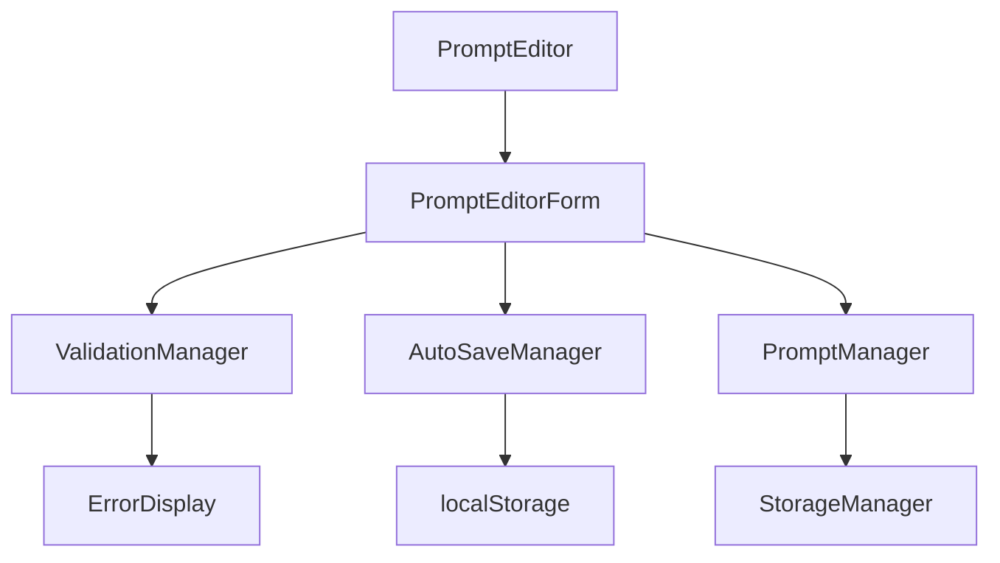

# TASK-0013: プロンプト作成・編集機能 - 要件定義

## 概要
ユーザーがプロンプトを効率的に作成・編集できる包括的なフォーム機能を実装する。リアルタイムバリデーション、下書き保存、キーボードショートカット対応により、優れたユーザー体験を提供する。

## 要件一覧

### REQ-EDITOR-001: プロンプト作成フォーム
**要件**: 新規プロンプト作成のための入力フォームを提供
- **必須項目**: タイトル、本文（content）
- **任意項目**: タグ、カテゴリー、説明
- **制約**: タイトル100文字以内、本文10,000文字以内
- **UI**: モーダルまたは専用ページでの表示

### REQ-EDITOR-002: リアルタイムバリデーション
**要件**: 入力中にリアルタイムでバリデーションを実行
- **バリデーション項目**:
  - タイトル必須（1文字以上、100文字以内）
  - 本文必須（1文字以上、10,000文字以内）
  - 特殊文字・制御文字の制限
- **表示方法**: インラインエラーメッセージ、フィールド枠線色変更
- **パフォーマンス**: デバウンス処理（300ms）で過度な処理を防止

### REQ-EDITOR-003: 文字数カウンター機能
**要件**: リアルタイムでの文字数表示と制限警告
- **表示内容**: 現在文字数/最大文字数
- **制限警告**: 90%到達で警告色表示、100%で入力禁止
- **位置**: 各入力フィールドの右下角
- **更新タイミング**: 入力の度にリアルタイム更新

### REQ-EDITOR-004: 自動保存・下書き機能
**要件**: 入力内容の自動保存と復元機能
- **保存タイミング**: 5秒間入力が無い場合に自動保存
- **保存場所**: localStorage（一時的）
- **復元機能**: ページ再読み込み時に下書き復元の確認
- **制限**: 下書きは1つまで、明示的保存後に削除

### REQ-EDITOR-005: 編集モード対応
**要件**: 既存プロンプトの編集機能
- **編集開始**: プロンプト一覧からの編集ボタンクリック
- **初期値設定**: 既存データの各フィールドへの自動入力
- **更新処理**: 編集完了時の既存データ更新
- **履歴保持**: 編集前の状態を一時保持（キャンセル用）

### REQ-EDITOR-006: キーボードショートカット
**要件**: 効率的な操作のためのショートカットキー
- **Ctrl+S**: 保存実行
- **Ctrl+Enter**: 保存して閉じる
- **Escape**: キャンセル・閉じる
- **Tab/Shift+Tab**: フィールド間移動
- **Ctrl+Z**: 元に戻す（テキストエリア内）

### REQ-EDITOR-007: UI/UX最適化
**要件**: ユーザビリティを重視したインターフェース
- **レスポンシブ**: Chrome拡張ポップアップサイズに最適化
- **自動フォーカス**: モーダル表示時にタイトルフィールドへフォーカス
- **エラー表示**: 明確で理解しやすいエラーメッセージ
- **保存フィードバック**: 成功・失敗の明確な視覚的フィードバック

## アーキテクチャ設計

### コンポーネント構成
```
PromptEditor
├── PromptEditorForm
│   ├── TitleField (バリデーション付き入力)
│   ├── ContentField (自動リサイズテキストエリア)
│   ├── TagsField (タグ入力・管理)
│   └── CharacterCounter (文字数カウンター)
├── PromptEditorActions (保存・キャンセルボタン)
├── PromptEditorValidation (バリデーション管理)
└── AutoSave (下書き自動保存)
```

### データフロー


### 状態管理
```typescript
interface PromptEditorState {
  mode: 'create' | 'edit';
  prompt: Partial<Prompt>;
  validation: ValidationState;
  isDirty: boolean;
  isSaving: boolean;
  hasAutoSave: boolean;
  errors: { [field: string]: string };
}

interface ValidationState {
  title: { valid: boolean; message: string };
  content: { valid: boolean; message: string };
  isFormValid: boolean;
}
```

## UI/UXデザイン

### モーダルレイアウト
```
┌─────────────────────────────────────┐
│ 📝 新しいプロンプト作成              ✕ │
├─────────────────────────────────────┤
│                                     │
│ タイトル *                           │
│ ┌─────────────────────────────────┐ │
│ │                               │ │ 0/100
│ └─────────────────────────────────┘ │
│                                     │
│ 本文 *                              │
│ ┌─────────────────────────────────┐ │
│ │                               │ │
│ │                               │ │ 0/10,000
│ │                               │ │
│ └─────────────────────────────────┘ │
│                                     │
│ タグ (任意)                         │
│ ┌─────────────────────────────────┐ │
│ │ #タグ1 #タグ2                  │ │
│ └─────────────────────────────────┘ │
│                                     │
├─────────────────────────────────────┤
│              [キャンセル] [保存]      │
└─────────────────────────────────────┘
```

### バリデーション表示
- **成功**: 緑の枠線、チェックアイコン
- **エラー**: 赤の枠線、エラーメッセージ
- **警告**: オレンジの枠線、警告メッセージ

### 保存状態表示
- **保存中**: スピナー + "保存中..."
- **成功**: 緑のチェック + "保存しました"
- **失敗**: 赤のX + エラーメッセージ

## 技術仕様

### バリデーションルール
```typescript
const validationRules = {
  title: {
    required: true,
    minLength: 1,
    maxLength: 100,
    pattern: /^[^\x00-\x1F\x7F]*$/ // 制御文字除外
  },
  content: {
    required: true,
    minLength: 1,
    maxLength: 10000,
    pattern: /^[\s\S]*$/ // 全文字許可（改行含む）
  },
  tags: {
    required: false,
    maxItems: 10,
    itemMaxLength: 20
  }
};
```

### 自動保存実装
```typescript
class AutoSaveManager {
  private saveTimeout: NodeJS.Timeout | null = null;
  private readonly SAVE_DELAY = 5000; // 5秒

  scheduleAutoSave(data: Partial<Prompt>): void {
    if (this.saveTimeout) {
      clearTimeout(this.saveTimeout);
    }
    
    this.saveTimeout = setTimeout(() => {
      this.saveToStorage(data);
    }, this.SAVE_DELAY);
  }

  private saveToStorage(data: Partial<Prompt>): void {
    const autoSaveData = {
      data,
      timestamp: Date.now(),
      version: '1.0'
    };
    localStorage.setItem('prompt_draft', JSON.stringify(autoSaveData));
  }
}
```

### キーボードショートカット実装
```typescript
private setupKeyboardShortcuts(): void {
  document.addEventListener('keydown', (e) => {
    // Ctrl+S: 保存
    if ((e.ctrlKey || e.metaKey) && e.key === 's') {
      e.preventDefault();
      this.savePrompt();
    }
    
    // Ctrl+Enter: 保存して閉じる
    if ((e.ctrlKey || e.metaKey) && e.key === 'Enter') {
      e.preventDefault();
      this.saveAndClose();
    }
    
    // Escape: キャンセル
    if (e.key === 'Escape') {
      this.handleCancel();
    }
  });
}
```

## アクセシビリティ実装

### ARIA属性
- `role="dialog"` - モーダルダイアログ
- `aria-labelledby` - モーダルタイトル参照
- `aria-describedby` - エラーメッセージ参照
- `aria-required="true"` - 必須フィールド
- `aria-invalid="true"` - バリデーションエラー時

### フォーカス管理
- モーダル表示時の自動フォーカス
- Tabキーでの適切な順序移動
- モーダル内でのフォーカストラップ
- 閉じる時の元要素への復帰

### スクリーンリーダー対応
- エラー状態の音声読み上げ
- 保存状態のアナウンス
- 文字数制限の動的アナウンス

## テスト戦略

### 単体テスト
- [ ] PromptEditor状態管理
- [ ] ValidationManager各種ルール
- [ ] AutoSaveManager保存・復元
- [ ] CharacterCounter計算ロジック

### 統合テスト
- [ ] フォーム入力～保存フロー
- [ ] バリデーションエラー処理
- [ ] 編集モード動作
- [ ] キーボードショートカット

### E2Eテスト
- [ ] プロンプト新規作成フロー
- [ ] 既存プロンプト編集フロー
- [ ] バリデーションエラー処理
- [ ] 自動保存・復元動作

### アクセシビリティテスト
- [ ] キーボードナビゲーション
- [ ] スクリーンリーダー対応
- [ ] WCAG 2.1 AA準拠確認

## 実装順序

### Phase 1: 基本フォーム
1. PromptEditor基本構造
2. TitleField・ContentField実装
3. 基本バリデーション
4. 保存・キャンセル機能

### Phase 2: 高度な機能
1. リアルタイムバリデーション
2. 文字数カウンター
3. 自動保存機能
4. 編集モード対応

### Phase 3: UX向上
1. キーボードショートカット
2. エラーハンドリング強化
3. アクセシビリティ対応
4. アニメーション・トランジション

### Phase 4: 品質向上
1. 包括的テスト実装
2. パフォーマンス最適化
3. エラー境界実装
4. セキュリティ検証

## 成功基準

### 機能要件
- [ ] 全必須フィールドでのバリデーション動作
- [ ] 10,000文字制限の適切な処理
- [ ] リアルタイム文字数カウンター
- [ ] 自動保存・復元機能の動作
- [ ] 編集モードでの既存データ読み込み

### 非機能要件
- [ ] フォーム表示1秒以内
- [ ] バリデーション応答100ms以内
- [ ] 自動保存処理の無感知動作
- [ ] Chrome拡張ポップアップサイズ最適化

### ユーザビリティ要件
- [ ] 直感的な操作フロー
- [ ] 明確なエラーメッセージ
- [ ] キーボード操作の完全対応
- [ ] レスポンシブデザイン

### 品質要件
- [ ] テストカバレッジ95%以上
- [ ] バリデーション処理のエッジケース対応
- [ ] メモリリークなし
- [ ] セキュリティ脆弱性なし