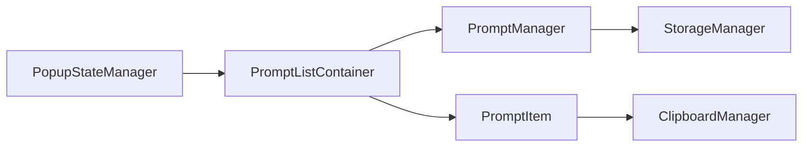

# TASK-0012: プロンプト一覧表示機能 - 要件定義

## 概要
プロンプト管理の核となる一覧表示機能を実装する。1000以上のプロンプトを効率的に表示し、ユーザーが素早く目的のプロンプトを見つけられるUIを提供する。

## 要件一覧

### REQ-LIST-001: プロンプトリスト基本表示
**要件**: プロンプト一覧をリスト形式で表示する
- **必須項目**: タイトル、内容プレビュー（50文字まで）、作成日時
- **任意項目**: 使用回数、最終使用日時、タグ
- **制約**: 空状態の適切な表示
- **パフォーマンス**: 初期表示3秒以内

### REQ-LIST-002: 仮想スクロール対応
**要件**: 大量データ（1000+アイテム）の効率的な表示
- **実装方式**: 仮想化リストを使用してメモリ使用量を最適化
- **表示範囲**: 可視範囲+バッファ領域のみDOM生成
- **スクロール性能**: 60FPS維持、ラグなし
- **制約**: 高さ固定アイテムでの実装

### REQ-LIST-003: ソート機能
**要件**: 複数条件でのソート機能を提供
- **ソート条件**:
  - 作成日時（新しい順/古い順）
  - 最終使用日時（最近使用順/古い順）  
  - 使用回数（多い順/少ない順）
  - タイトル（アルファベット順/逆順）
- **デフォルト**: 最終使用日時（最近使用順）
- **UI**: ドロップダウンまたはヘッダークリック

### REQ-LIST-004: プロンプトアイテム操作
**要件**: 各プロンプトに対する基本操作を提供
- **操作メニュー**:
  - プロンプトコピー（ワンクリック）
  - 編集モード移行
  - 削除（確認ダイアログ付き）
  - 詳細表示/展開
- **キーボード操作**: 矢印キー選択、Enter決定、Delete削除
- **アクセシビリティ**: スクリーンリーダー対応

### REQ-LIST-005: ローディング・エラー状態
**要件**: 各種状態に対する適切なUI表示
- **ローディング状態**: スケルトンローディングまたはスピナー
- **エラー状態**: 再試行ボタン付きエラーメッセージ
- **空状態**: 初回利用向けCTA（Call To Action）
- **検索結果なし**: 検索条件変更の提案

### REQ-LIST-006: レスポンシブデザイン
**要件**: Chrome拡張ポップアップサイズに最適化
- **固定サイズ**: 400px × 600px（TASK-0011準拠）
- **可変コンテンツ**: 内容に応じた高さ調整
- **最小サイズ**: 320px幅まで対応
- **タブレット対応**: 将来的なオプションページ展開を考慮

## アーキテクチャ設計

### コンポーネント構成
```
PromptListContainer
├── PromptListHeader (ソート・操作)
├── VirtualizedPromptList (仮想スクロール)
│   └── PromptItem[] (個別アイテム)
├── PromptListFooter (統計情報)
└── StateDisplays (Loading/Error/Empty)
```

### データフロー


### 状態管理
```typescript
interface PromptListState {
  prompts: Prompt[];
  loading: boolean;
  error: Error | null;
  sortBy: SortOption;
  sortDirection: 'asc' | 'desc';
  selectedPromptId: string | null;
  viewMode: 'list' | 'grid';
}

type SortOption = 'createdAt' | 'usedAt' | 'usageCount' | 'title';
```

## UI/UXデザイン

### ビジュアル階層
1. **ヘッダー部分**: ソート選択、表示モード切り替え
2. **メイン部分**: プロンプトリスト（スクロール可能）
3. **フッター部分**: 総件数、フィルタ結果

### プロンプトアイテムデザイン
```
[📝] プロンプトタイトル                    [⋮]
     プロンプト内容のプレビューテキスト...
     👥 3回使用 • 📅 2時間前 • 🏷️ タグ名
```

### インタラクション
- **ホバー**: 背景色変更、操作ボタン表示
- **フォーカス**: キーボードナビゲーション対応  
- **選択**: チェックボックスで複数選択（将来機能）
- **ドラッグ**: 並び替え（将来機能）

## 技術仕様

### パフォーマンス要件
- **初期表示**: 3秒以内
- **スクロール**: 60FPS維持
- **操作応答**: 100ms以内
- **メモリ使用量**: 50MB以内（1000件時）

### 仮想スクロール実装
```typescript
class VirtualizedList {
  private itemHeight = 80; // 固定高さ
  private viewportHeight = 400;
  private bufferSize = 3; // 前後のバッファ

  private getVisibleRange(): [number, number] {
    const scrollTop = this.scrollContainer.scrollTop;
    const start = Math.floor(scrollTop / this.itemHeight);
    const visible = Math.ceil(this.viewportHeight / this.itemHeight);
    return [
      Math.max(0, start - this.bufferSize),
      Math.min(this.items.length, start + visible + this.bufferSize)
    ];
  }
}
```

### アクセシビリティ実装
- **ARIA属性**: `role="list"`, `aria-label="プロンプト一覧"`
- **キーボード操作**: `tabIndex`, `onKeyDown`ハンドラー
- **スクリーンリーダー**: 動的な内容変更のアナウンス
- **フォーカス管理**: 削除後の適切なフォーカス移動

## テスト戦略

### 単体テスト
- [ ] PromptListContainer状態管理
- [ ] VirtualizedList表示ロジック  
- [ ] PromptItem操作
- [ ] ソート・フィルタリング

### 統合テスト
- [ ] StorageManager連携
- [ ] ClipboardManager連携
- [ ] PopupStateManager連携

### E2Eテスト
- [ ] プロンプト表示フロー
- [ ] ソート操作フロー
- [ ] コピー操作フロー
- [ ] キーボード操作フロー

### パフォーマンステスト
- [ ] 1000件データ表示
- [ ] スクロール性能測定
- [ ] メモリリーク検証

## 実装順序

### Phase 1: 基本一覧表示
1. PromptListContainer基本実装
2. PromptItem基本表示
3. StorageManager連携
4. 基本状態管理（Loading/Error/Empty）

### Phase 2: 仮想スクロール
1. VirtualizedList実装
2. パフォーマンス最適化
3. 大量データテスト

### Phase 3: ソート・操作
1. ソート機能実装
2. アイテム操作メニュー
3. キーボード操作

### Phase 4: 品質向上
1. アクセシビリティ対応
2. エラーハンドリング強化
3. 包括的テスト実装

## 成功基準

### 機能要件
- [ ] 1000件のプロンプトを滑らかに表示
- [ ] 全ソートオプションが正常動作
- [ ] ワンクリックコピーが1秒以内完了
- [ ] キーボード操作で全機能利用可能

### 非機能要件
- [ ] 初期表示3秒以内
- [ ] スクロール60FPS維持
- [ ] WCAG 2.1 AA基準準拠
- [ ] Chrome拡張サイズ最適化

### 品質要件
- [ ] テストカバレッジ90%以上
- [ ] 主要ブラウザでの動作確認
- [ ] メモリリークなし
- [ ] エラー処理完備