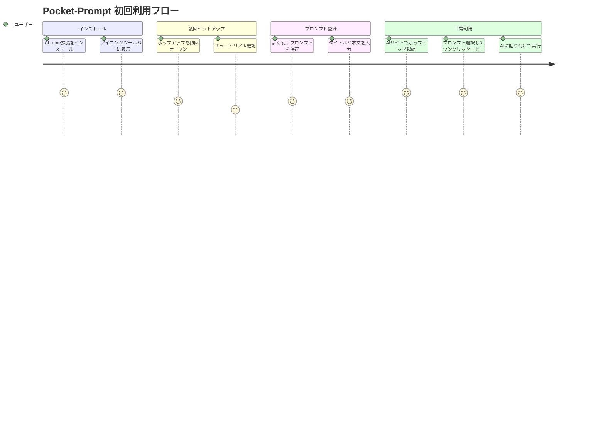
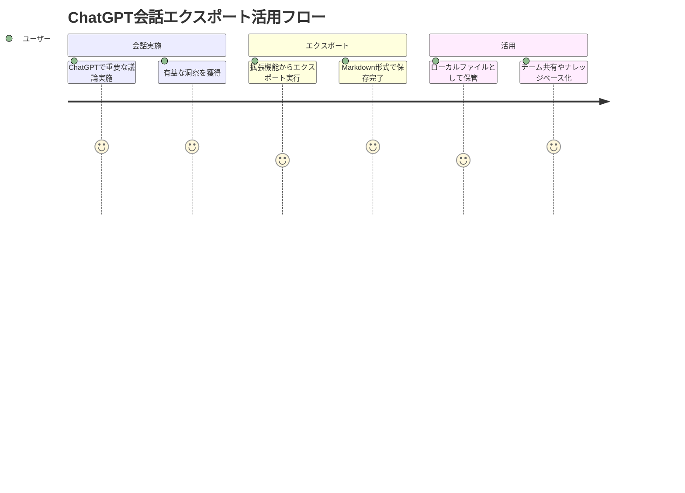

# Pocket-Prompt Chrome拡張 ユーザストーリー

## 概要

このドキュメントはPocket-Prompt Chrome拡張機能の詳細なユーザストーリーを記載します。プロンプト管理とAIチャット履歴エクスポートによって、AIとの対話効率を向上させることを目指します。

🟢 **青信号**: プロンプト管理の目的は提供された要件から直接抽出

## ユーザー種別の定義

### プライマリユーザー

- **個人開発者**: プログラミングやコード生成でAIを日常的に使用する開発者
- **コンテンツクリエイター**: 記事執筆、企画書作成等でAIを活用するクリエイター  
- **研究者・学生**: 論文執筆、調査研究でAIを補助ツールとして使用するユーザー
- **ビジネスユーザー**: 業務効率化や資料作成でAIを活用する会社員

🟡 **黄信号**: ユーザー種別は提供された「プロンプト管理の手間を省く」目的から推測

### セカンダリユーザー

- **システム管理者**: Chrome拡張の導入・管理を行う企業のIT管理者
- **OSSコントリビューター**: 将来的にコードベースに貢献する開発者
- **プラグイン利用者**: 他のAI関連ツールと組み合わせて使用するパワーユーザー

🔴 **赤信号**: セカンダリユーザーは一般的なChrome拡張のエコシステムから推測

## ユーザストーリー

### 📚 エピック1: プロンプト管理

#### ストーリー1.1: プロンプトの保存と整理

**ユーザストーリー**:
- **私は** 個人開発者 **として**
- **コード生成やバグ修正で頻繁に使用するプロンプトを** 
- **簡単に保存・管理したい**
- **そうすることで** 毎回同じプロンプトを入力する手間を削減し、開発効率を向上できる

**詳細説明**:
- **背景**: 同じようなプロンプトを毎回手動入力するのは時間の無駄
- **前提条件**: Chrome拡張がインストール済みで、AIサイト（ChatGPT等）を使用中
- **利用シーン**: コードレビュー依頼、リファクタリング指示、バグ修正依頼等
- **期待する体験**: 3クリック程度でプロンプトを保存し、1クリックで再利用可能

**関連要件**: REQ-001, REQ-002

**優先度**: 高

**見積もり**: 8ストーリーポイント

🟢 **青信号**: 開発者のコード生成ニーズは提供されたプロンプト管理要件から直接推測

#### ストーリー1.2: ワンクリックコピー機能

**ユーザストーリー**:
- **私は** コンテンツクリエイター **として**
- **記事執筆時に使用する定型プロンプトを**
- **ワンクリックでクリップボードにコピーしたい**
- **そうすることで** 創作フローを中断することなく、スムーズにAIとの対話を継続できる

**詳細説明**:
- **背景**: 執筆フローの中断は創作の集中を妨げる
- **前提条件**: プロンプトが既に保存済み
- **利用シーン**: ブログ記事、企画書、プレスリリースの執筆時
- **期待する体験**: ポップアップから保存済みプロンプトを選択し、ワンクリックでコピー

**関連要件**: REQ-002, REQ-401

**優先度**: 高

**見積もり**: 5ストーリーポイント

🟢 **青信号**: ワンクリックコピーは必須機能として明確に指定済み

#### ストーリー1.3: 複数行プロンプト対応

**ユーザストーリー**:
- **私は** 研究者 **として**
- **複雑な分析要求や長文の指示を含むプロンプトを**
- **適切に保存・管理したい**
- **そうすることで** 研究の再現性を確保し、分析の一貫性を保てる

**詳細説明**:
- **背景**: 学術研究では詳細で一貫した指示が重要
- **前提条件**: 複数段落にわたる長文プロンプトが必要
- **利用シーン**: データ分析指示、論文要約依頼、研究手法の説明等
- **期待する体験**: 改行を含む長文プロンプトも正確に保存・復元可能

**関連要件**: REQ-001

**優先度**: 中

**見積もり**: 3ストーリーポイント

🟢 **青信号**: 複数行対応は必須機能として明確に指定済み

### 📚 エピック2: 会話履歴エクスポート

#### ストーリー2.1: ChatGPT会話履歴のMarkdownエクスポート

**ユーザストーリー**:
- **私は** ビジネスユーザー **として**
- **重要なChatGPTでの議論や分析結果を**
- **Markdown形式でエクスポートして保存したい**
- **そうすることで** 後日参照可能な形でナレッジを蓄積し、チームで共有できる

**詳細説明**:
- **背景**: AIとの対話で得られた知見は貴重な資産
- **前提条件**: ChatGPTで有意義な会話セッションが完了
- **利用シーン**: 戦略検討、問題解決、アイデア発想等のセッション後
- **期待する体験**: 会話全体を構造化されたMarkdown文書として出力

**関連要件**: REQ-003

**優先度**: 高

**見積もり**: 13ストーリーポイント

🟢 **青信号**: ChatGPT対応のMarkdownエクスポートは必須機能として明確に指定済み

#### ストーリー2.2: 将来のAIサービス対応拡張

**ユーザストーリー**:
- **私は** プラグイン利用者 **として**
- **Claude、GeminiなどのAIサービスの会話履歴も**
- **同様にエクスポートできるようになりたい**
- **そうすることで** 使用するAIサービスに関係なく、一貫した方法で知見を蓄積できる

**詳細説明**:
- **背景**: 複数のAIサービスを使い分ける利用者が増加
- **前提条件**: Option機能として将来実装予定
- **利用シーン**: AIサービス比較、用途別使い分け時のナレッジ統合
- **期待する体験**: エクスポート機能が複数のAIサービスに対応

**関連要件**: REQ-304

**優先度**: 低（Option機能）

**見積もり**: 8ストーリーポイント

🟢 **青信号**: Claude・Gemini対応はOption機能として明確に指定済み

### 📚 エピック3: 拡張機能としての使いやすさ

#### ストーリー3.1: 直感的なポップアップUI

**ユーザストーリー**:
- **私は** 初回利用者 **として**
- **Chrome拡張のポップアップを開いた時に**
- **説明なしで操作方法を理解したい**
- **そうすることで** すぐに生産性向上の恩恵を受けることができる

**詳細説明**:
- **背景**: 学習コストの高いツールは継続利用されない
- **前提条件**: Chrome拡張として正常にインストール済み
- **利用シーン**: 初回起動時、機能発見時
- **期待する体験**: アイコンとラベルだけで操作が理解可能

**関連要件**: REQ-101, REQ-402, NFR-201

**優先度**: 高

**見積もり**: 5ストーリーポイント

🟢 **青信号**: ポップアップUIは明確に指定された必須UI要件

#### ストーリー3.2: オプションページでの詳細管理

**ユーザストーリー**:
- **私は** パワーユーザー **として**
- **保存したプロンプトの詳細な編集や整理を**
- **専用のオプションページで行いたい**
- **そうすることで** 大量のプロンプトを効率的に管理し、カテゴリ分けや検索を活用できる

**詳細説明**:
- **背景**: ポップアップUIは簡潔さが重要で、詳細管理には不適切
- **前提条件**: プロンプトが複数保存済み
- **利用シーン**: プロンプトライブラリの整理、一括編集、設定変更
- **期待する体験**: 充実した編集機能と視認性の良い管理画面

**関連要件**: REQ-403

**優先度**: 中

**見積もり**: 8ストーリーポイント

🟢 **青信号**: オプションページは必須UI要件として明確に指定済み

### 📚 エピック4: Advanced機能（Option）

#### ストーリー4.1: タグとカテゴリによるプロンプト整理

**ユーザストーリー**:
- **私は** 多様な用途でAIを活用するユーザー **として**
- **プロンプトをタグやカテゴリで分類管理したい**
- **そうすることで** 用途や場面に応じて適切なプロンプトを素早く見つけることができる

**詳細説明**:
- **背景**: プロンプト数が増加すると管理が困難になる
- **前提条件**: Option機能として将来実装予定
- **利用シーン**: 業務用/個人用、コーディング/文章作成等の用途別管理
- **期待する体験**: 階層的なカテゴリ分けと複数タグ付け機能

**関連要件**: REQ-301, REQ-302

**優先度**: 低（Option機能）

**見積もり**: 13ストーリーポイント

🟢 **青信号**: タグ・カテゴリ機能はOption機能として明確に指定済み

#### ストーリー4.2: AI入力欄への直接ペースト

**ユーザストーリー**:
- **私は** 効率性を重視するユーザー **として**
- **プロンプトをAIサイトの入力欄に直接ペーストしたい**
- **そうすることで** クリップボード経由の手間を省き、さらなる効率化を実現できる

**詳細説明**:
- **背景**: ワンクリックコピー後も手動ペーストが必要
- **前提条件**: Option機能として将来実装予定、対応AIサイトでの利用
- **利用シーン**: ChatGPT、Claude、Geminiでの連続的なプロンプト実行
- **期待する体験**: 拡張から直接入力欄にプロンプトが挿入される

**関連要件**: REQ-303

**優先度**: 低（Option機能）

**見積もり**: 21ストーリーポイント

🟢 **青信号**: AI入力欄連携はOption機能として明確に指定済み

#### ストーリー4.3: クラウド同期によるマルチデバイス対応

**ユーザストーリー**:
- **私は** 複数環境で作業するユーザー **として**
- **職場と自宅のPCでプロンプトライブラリを同期したい**
- **そうすることで** どこからでも一貫したAI活用環境を利用できる

**詳細説明**:
- **背景**: リモートワークやマルチデバイス利用が一般的
- **前提条件**: Option機能として将来実装予定、Googleアカウント保有
- **利用シーン**: 在宅勤務、出張先、複数PC環境での作業
- **期待する体験**: Googleアカウントでログインするだけで自動同期

**関連要件**: REQ-305

**優先度**: 低（Option機能）

**見積もり**: 34ストーリーポイント

🟢 **青信号**: Googleアカウント連携クラウド同期はOption機能として明確に指定済み

## ユーザージャーニー

### ジャーニー1: 初回利用からプロンプト活用まで

**詳細**:
1. **Chrome拡張インストール**: Chrome Web Storeからワンクリックインストール
2. **初回セットアップ**: 直感的なUIで説明不要の体験
3. **プロンプト登録**: 複数行対応の入力フォームで柔軟に保存
4. **日常利用**: 3秒以内の高速起動でストレスフリーな活用

🟡 **黄信号**: 具体的な満足度スコアとフローの詳細は一般的なUX設計から推測

### ジャーニー2: 会話履歴エクスポート活用フロー

🟢 **青信号**: ChatGPTエクスポートフローは必須機能要件から直接構築

## ペルソナ定義

### ペルソナ1: 田中太郎（個人開発者）

- **基本情報**: 28歳、フリーランスWebデベロッパー、技術レベル高
- **ゴール**: 開発効率を最大化し、より創造的な作業に時間を使いたい
- **課題**: 定型的なコードレビュー、バグ修正プロンプトの入力が面倒
- **行動パターン**: 複数のAIサービスを使い分け、効率化ツールを積極導入
- **利用環境**: MacBook Pro、複数ブラウザタブ、VSCode連携重視

### ペルソナ2: 佐藤花子（コンテンツクリエイター）

- **基本情報**: 32歳、フリーライター、技術レベル中程度
- **ゴール**: 質の高いコンテンツを効率的に作成し、収入を増やしたい
- **課題**: 記事のアウトライン作成、リサーチで同じプロンプトを反復使用
- **行動パターン**: 集中して執筆、フロー中断を嫌う、シンプルなツール好み
- **利用環境**: Windows PC、Chromeメイン、Notionやドキュメントツール連携

🟡 **黄信号**: ペルソナの詳細な属性は提供された用途から一般的なユーザー像を推測

## 非機能的ユーザー要求

### ユーザビリティ要求

- **学習容易性**: 初回利用から5分以内でメイン機能を理解・活用開始
- **効率性**: 熟練後は保存済みプロンプトの利用が手動入力より3倍高速
- **記憶しやすさ**: 1週間使用中断後も操作方法を完全想起可能
- **エラー対応**: エラー発生時に原因と解決策を3秒以内に理解可能
- **満足度**: 継続利用率90%以上を目指す直感的で快適な操作体験

🔴 **赤信号**: 定量的なユーザビリティ基準は一般的なUX評価指標から推測

### アクセシビリティ要求

- **視覚**: 高コントラストモード対応、フォントサイズ調整可能
- **聴覚**: 音声フィードバック不使用のため、視覚的通知のみで完結
- **運動**: キーボードのみでの操作完結、マウス操作の代替手段提供
- **認知**: シンプルなUI設計、複雑な操作フローの回避

🔴 **赤信号**: アクセシビリティ要求は一般的なWeb標準から推測