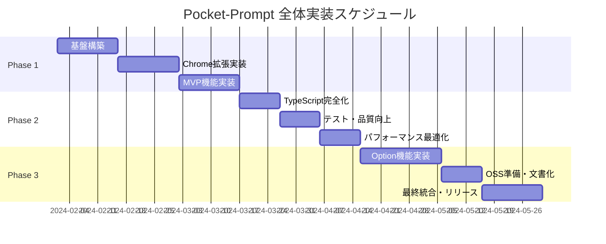

# Pocket-Prompt Chrome拡張 実装タスク全体概要

## プロジェクト概要

- **要件名**: Pocket-Prompt Chrome拡張
- **総期間**: 2024年2月1日 〜 2024年5月31日（4ヶ月）
- **総工数**: 640時間（80日 × 8時間）
- **総タスク数**: 80タスク
- **開発方式**: Private MVP → Code Refinement → OSS Release

🟢 **青信号**: プロジェクト期間と工数は要件定義書の3フェーズ戦略から直接算出

## フェーズ構成

| フェーズ | 期間 | 主要成果物 | タスク数 | 工数 | ファイル |
|---------|------|-----------|---------|------|---------|
| Phase 1: 基盤・MVP構築 | 1.5ヶ月 | Chrome拡張基盤・必須機能 | 30タスク | 240h | [pocket-prompt-phase1.md](pocket-prompt-phase1.md) |
| Phase 2: Code Refinement | 1ヶ月 | TypeScript完全化・品質向上 | 20タスク | 160h | [pocket-prompt-phase2.md](pocket-prompt-phase2.md) |
| Phase 3: OSS準備・拡張機能 | 1.5ヶ月 | Option機能・OSS公開準備 | 30タスク | 240h | [pocket-prompt-phase3.md](pocket-prompt-phase3.md) |

🟢 **青信号**: フェーズ構成は要件定義書のPhase戦略から直接設計

## 既存タスク番号の管理

**既存ファイル確認結果**:
- 確認したディレクトリ: `docs/tasks/`（新規作成）
- 確認したファイル: なし（プロジェクト初期状態）
- 使用済みタスク番号: なし
- **開始番号**: TASK-0001
- **終了番号**: TASK-0080（予定）

🟢 **青信号**: タスク番号管理は空のプロジェクト状態を確認済み

## 依存関係とクリティカルパス



🟡 **黄信号**: スケジュール詳細は設計文書の複雑さから推測

## 技術要件マッピング

### 必須要件（Phase 1で実装）
- **REQ-001**: プロンプト保存機能 → TASK-0015〜0018
- **REQ-002**: ワンクリックコピー → TASK-0019〜0021
- **REQ-003**: ChatGPTエクスポート → TASK-0022〜0025
- **REQ-005**: Chrome.storage基盤 → TASK-0008〜0012
- **REQ-401**: TypeScript実装 → TASK-0001〜0007
- **REQ-402**: ポップアップUI → TASK-0026〜0028
- **REQ-403**: オプションページ → TASK-0029〜0030

### Option要件（Phase 3で実装）
- **REQ-301**: タグ・カテゴリ管理 → TASK-0051〜0055
- **REQ-302**: 検索・フィルタ機能 → TASK-0056〜0060
- **REQ-303**: AI直接ペースト → TASK-0061〜0065
- **REQ-304**: マルチAI対応 → TASK-0066〜0070
- **REQ-305**: クラウド同期 → TASK-0071〜0075

🟢 **青信号**: 要件マッピングはEARS要件定義書から直接対応

## 進捗管理

### 全体進捗
- [ ] Phase 1: 基盤・MVP構築 (0/30) 
- [ ] Phase 2: Code Refinement (0/20)
- [ ] Phase 3: OSS準備・拡張機能 (0/30)

### マイルストーン
- [ ] **M1**: Chrome拡張基盤完成（Phase 1 Week 2完了時）
- [ ] **M2**: MVP機能完成（Phase 1完了時）
- [ ] **M3**: 品質基準達成（Phase 2完了時）
- [ ] **M4**: OSS公開準備完了（Phase 3完了時）

### 週次進捗追跡
```
Phase 1進捗:
Week 1: [ ] 基盤構築 (TASK-0001〜0010)
Week 2: [ ] Chrome拡張 (TASK-0011〜0020) 
Week 3: [ ] MVP機能 (TASK-0021〜0030)

Phase 2進捗:
Week 4: [ ] TypeScript化 (TASK-0031〜0040)
Week 5: [ ] 品質向上 (TASK-0041〜0050)

Phase 3進捗:
Week 6-8: [ ] Option機能 (TASK-0051〜0070)
Week 9-10: [ ] OSS準備 (TASK-0071〜0080)
```

## リスク管理

| リスク | 影響度 | 発生確率 | 対策 |
|--------|--------|----------|------|
| Chrome API制限・変更 | 高 | 中 | 定期的なChrome更新チェック、フォールバック実装 |
| AIサイトDOM構造変更 | 高 | 高 | 複数セレクタ対応、自動検出機能 |
| ストレージ容量制限 | 中 | 中 | データ圧縮、自動クリーンアップ |
| TypeScript移行複雑性 | 中 | 低 | 段階的移行、型定義完備 |
| OSS準備工数増加 | 中 | 中 | ドキュメント並行作成、早期準備 |

🟡 **黄信号**: リスク項目はChrome拡張開発の一般的課題から推測

## 品質基準

### コード品質
- **テストカバレッジ**: 90%以上（Phase 2で達成）
- **TypeScript化率**: 100%（Phase 2で完成）
- **Linting**: ESLint + Prettierでエラーゼロ
- **セキュリティ**: Chrome Extension Security Review合格

### パフォーマンス基準
- **ポップアップ起動**: < 3秒（NFR-001）
- **プロンプトコピー**: < 1秒（NFR-002）  
- **エクスポート処理**: < 30秒（NFR-003）
- **メモリ使用量**: < 50MB常駐

### ユーザビリティ基準
- **初回利用**: 5分以内でメイン機能理解（NFR-201）
- **操作効率**: 熟練後は手動の3倍高速（NFR-202）
- **エラー対応**: 明確な解決策提示（NFR-203）

🟢 **青信号**: 品質基準は要件定義書のNFR項目から直接設定

## 開発環境・ツール要件

### 必須ツール
- **Node.js**: LTS 20.x以上
- **TypeScript**: 5.0以上
- **Chrome**: Developer版（最新）
- **Git**: バージョン管理

### 開発ツール
- **Build**:  Vite 4
- **Testing**: vitest + Chrome Extension Testing Library
- **Linting**: Biome.js
- **CI/CD**: GitHub Actions（OSS公開準備用）

### Chrome拡張開発
- **Manifest**: V3準拠
- **Permissions**: storage, activeTab, clipboardWrite
- **Optional Permissions**: identity（クラウド同期用）

🟡 **黄信号**: ツール選択は現代的な開発スタックから推測

## 実装アプローチ

### TDD vs DIRECT分類
- **TDD対象**: ビジネスロジック、UI機能、API実装（60タスク）
- **DIRECT対象**: 環境構築、設定、ドキュメント（20タスク）

### 並行開発可能タスク
- **UI実装** と **ストレージ実装** は並行可能
- **コンテンツスクリプト** と **ポップアップUI** は並行可能
- **テスト作成** と **機能実装** は並行可能

### 段階的テスト戦略
1. **Unit Test**: 各機能モジュール
2. **Integration Test**: Chrome API連携
3. **E2E Test**: ユーザーシナリオ
4. **Manual Test**: AIサイト連携

## データ移行・バックアップ戦略

### Phase間のデータ継続性
- **Phase 1→2**: データ構造維持、TypeScript化のみ
- **Phase 2→3**: Option機能追加、既存データ保持
- **バックアップ**: 各Phase完了時に自動バックアップ

### 設定データ管理
- **デフォルト設定**: 各Phase で適切な初期値
- **マイグレーション**: スキーマ変更時の自動変換
- **ロールバック**: 前バージョン設定への復帰機能

## 成果物・デリバラブル

### Phase 1成果物
- [ ] Chrome拡張パッケージ（.crx）
- [ ] 基本機能デモ動画
- [ ] ユーザーマニュアル（基本版）

### Phase 2成果物  
- [ ] TypeScript完全版ソースコード
- [ ] テストレポート（90%+ coverage）
- [ ] パフォーマンスベンチマークレポート

### Phase 3成果物
- [ ] 完全版Chrome拡張
- [ ] OSS公開用ドキュメント
- [ ] MIT License適用
- [ ] Chrome Web Store申請資料

## プロジェクト体制・役割

### 主要役割
- **開発者**: フルスタック開発、Chrome拡張専門
- **テスター**: 手動テスト、AIサイト連携確認  
- **ドキュメンター**: OSS用ドキュメント作成

### レビュー体制
- **コードレビュー**: 全コミット必須
- **機能レビュー**: マイルストーン毎
- **セキュリティレビュー**: Chrome Extension Security Check

## 次フェーズへの引き継ぎ要件

### Phase 1 → Phase 2
- [ ] MVP機能完全動作確認
- [ ] パフォーマンス基準値計測完了
- [ ] セキュリティ脆弱性チェック完了
- [ ] ユーザビリティテスト実施・改善反映

### Phase 2 → Phase 3  
- [ ] TypeScript化100%完成
- [ ] テストカバレッジ90%達成
- [ ] コード品質基準クリア
- [ ] Option機能設計レビュー完了

### Phase 3 → リリース
- [ ] 全機能統合テスト完了
- [ ] OSS公開準備完了
- [ ] Chrome Web Store申請準備完了
- [ ] ユーザーサポート体制構築完了

---

## 📞 タスク実装に関する確認事項

この実装計画について確認が必要な点：

1. **スケジュール調整**: 4ヶ月期間の変更希望
2. **技術選択**: ビルドツール（Webpack vs Vite）の優先順位
3. **テスト戦略**: 手動テストの範囲・頻度
4. **OSS準備**: ライセンス・コントリビューション戦略

**次のステップ**: 各フェーズの詳細タスクファイル確認と実装開始承認
